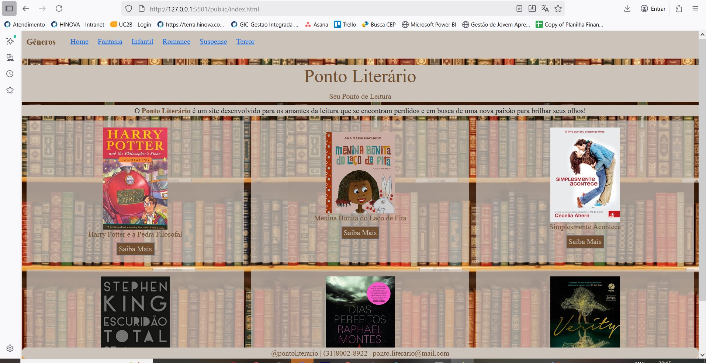
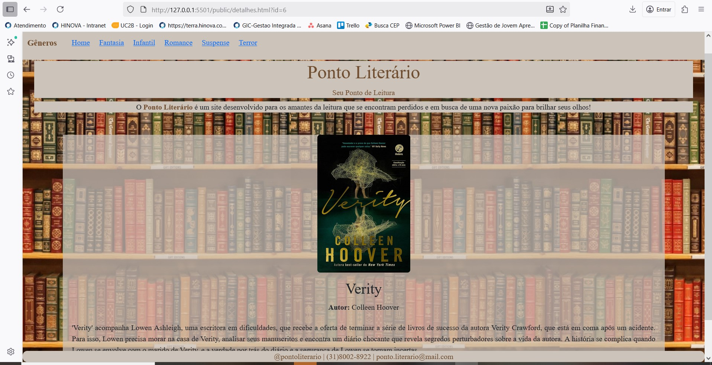

[](https://classroom.github.com/online_ide?assignment_repo_id=21081546&assignment_repo_type=AssignmentRepo)
# Trabalho Prático 05 - Semanas 7 e 8

**Páginas de detalhes dinâmicas**

Nessa etapa, vamos evoluir o trabalho anterior, acrescentando a página de detalhes, conforme o  projeto escolhido. Imagine que a página principal (home-page) mostre um visão dos vários itens que existem no seu site. Ao clicar em um item, você é direcionado pra a página de detalhes. A página de detalhe vai mostrar todas as informações sobre o item do seu projeto. seja esse item uma notícia, filme, receita, lugar turístico ou evento.

Leia o enunciado completo no Canvas. 

**IMPORTANTE:** Assim como informado anteriormente, capriche na etapa pois você vai precisar dessa parte para as próximas semanas. 

**IMPORTANTE:** Você deve trabalhar e alterar apenas arquivos dentro da pasta **`public`,** mantendo os arquivos **`index.html`**, **`styles.css`** e **`app.js`** com estes nomes, conforme enunciado. Deixe todos os demais arquivos e pastas desse repositório inalterados. **PRESTE MUITA ATENÇÃO NISSO.**

## Informações Gerais

- Nome:Amanda Oliveira da Silva 
- Matricula: 00904102
- Proposta de projeto escolhida: Site de buscas de livros
- Breve descrição sobre seu projeto: Um site para leitores que buscam um novo livro

## Print da Home-Page



## Print da página de detalhes do item



## Cole aqui abaixo a estrutura JSON utilizada no app.js

```javascript
const livros = [
    {
        "id": 1,
        "img": "img/harrypotterjscript.jpg",
        "Livro": "Harry Potter e a Pedra Filosofal",
        "Autor": "J.K Rowling",
        "Sinopse": "'Harry Potter' conta a história do jovem Harry que aos 11 anos descobre ser um bruxo e é convidado para a escola de magia e bruxaria de Hogwarts, onde encontra amigos como Rony e Hermione e aprende sobre seu passado, o assassinato de seus pais pelo temível Lord Voldemort e sua conexão com ele. Ele e seus amigos descobrem um plano para roubar a Pedra Filosofal e tentam impedi-lo da imortalidade e seu retorno ao poder."
    },
    {
        "id": 2,
        "img": "img/meninabonitajscript.jpg",
        "Livro": "Menina Bonita do Laço de Fita",
        "Autor": "Ana Maria Machado",
        "Sinopse": "'Menina Bonita do Laço de Fita' narra a aventura de um coelho branco que, apaixonado pela menina negra de pele escura e cabelos enrolados, busca o segredo para ser preto. A menina inventa histórias como cair em tinta preta ou comer jabuticabas, mas o coelho não consegue imitar a cor dela. A mãe da menina revela que o segredo é a beleza de sua avó preta. O coelho, então, casa-se com uma coelha preta e tem filhos de várias cores, incluindo uma coelha pretinha, afilhada da menina, que se torna um símbolo de aceitação da diversidade e da beleza da negritude."
    },
    {
        "id": 3,
        "img": "img/simplesmentejscript.jpg",
        "Livro": "Simplesmente Acontece",
        "Autor": "Cecelia Ahern",
        "Sinopse": "'Simplesmente Acontece' conta a história de Rosie e Alex, que são amigos inseparáveis desde a infância, mas são separados quando Alex se muda para os Estados Unidos, e os anos subsequentes são marcados por uma série de desencontros e circunstâncias que os mantêm longe, apesar do amor que sentem um pelo outro."
    },
    {
        "id": 4,
        "img": "img/escuridaojscript.jpg",
        "Livro": "Escuridão Total sem Estrelas",
        "Autor": "Stephen King",
        "Sinopse": "'Escuridão Total Sem Estrelas' é uma coleção de quatro contos de Stephen King, onde os personagens enfrentam situações extremas de escuridão moral, sem auxílio de bom senso, piedade ou justiça. Cada história explora o lado sombrio da natureza humana e as escolhas difíceis que as pessoas fazem em momentos de crise."
    },
    {
        "id": 5,
        "img": "img/diasjscript.jpg",
        "Livro": "Dias Perfeitos",
        "Autor": "Raphael Montes",
        "Sinopse": "'Dias Perfeitos' de Raphael Montes conta a história de Téo, um estudante de medicina obcecado por Clarice, uma aspirante a roteirista. Após ela rejeitar suas investidas, Téo a sequestra para uma viagem pelo Rio de Janeiro, acreditando que, longe de tudo, ela acabará por amá-lo. O romance é um thriller sombrio e claustrofóbico narrado sob a perspectiva do sequestrador, que utiliza seus conhecimentos de medicina para manter Clarice sedada e ao seu lado."
    },
    {
        "id": 6,
        "img": "img/verityjscript.jpg",
        "Livro": "Verity",
        "Autor": "Colleen Hoover",
        "Sinopse": "'Verity' acompanha Lowen Ashleigh, uma escritora em dificuldades, que recebe a oferta de terminar a série de livros de sucesso da autora Verity Crawford, que está em coma após um acidente. Para isso, Lowen precisa morar na casa de Verity, analisar seus manuscritos e encontra um diário chocante que revela segredos perturbadores sobre a vida da autora. A história se complica quando Lowen se envolve com o marido de Verity, e a verdade por trás do diário e a segurança de Lowen se tornam incertas."
    }
];
```